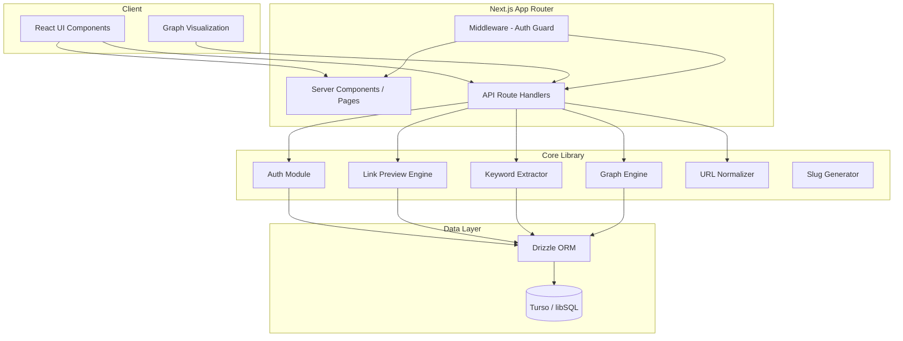

# Design Document: Bitácora

## Overview

Bitácora is a self-hostable personal knowledge harbor built with Next.js, TypeScript, Tailwind CSS, Turso (libSQL), and Drizzle ORM. The architecture follows Next.js App Router conventions with server components, API route handlers, and middleware-based authentication. The system is designed for single-user deployment with no AI dependencies in the MVP.

The core architectural flow:
1. User saves content through Quick Capture
2. System extracts metadata and keywords
3. Graph engine automatically generates edges
4. User browses content through views and graph visualization

## Architecture



### Key Architectural Decisions

1. **Next.js App Router**: Server components for data-fetching pages, client components for interactivity (graph, quick capture). API routes for all CRUD operations.
2. **Middleware-based auth**: A single middleware.ts at src/ root checks session cookies on every /app/*, /settings, and /api/* (except /api/auth/*) route.
3. **Turso/libSQL**: SQLite-compatible cloud database with free tier. Drizzle ORM for type-safe schema and queries.
4. **No AI**: All intelligence (keyword extraction, graph scoring) uses rule-based algorithms.
5. **Single-user model**: Admin created from env vars on first run. No user registration flow needed.

## Components and Interfaces

### Authentication Module (`src/lib/auth.ts`)

```typescript
interface SessionPayload {
  userId: string;
  email: string;
  expiresAt: number;
}

function hashPassword(password: string): Promise<string>;
function verifyPassword(password: string, hash: string): Promise<boolean>;
function createSession(userId: string): Promise<string>; // returns cookie value
function validateSession(cookie: string): SessionPayload | null;
function destroySession(): void;
function getSessionFromRequest(request: Request): SessionPayload | null;
function ensureAdminExists(): Promise<void>;
```

### Link Preview Engine (`src/lib/preview.ts`)

```typescript
interface LinkPreview {
  title: string | null;
  description: string | null;
  imageUrl: string | null;
  faviconUrl: string | null;
  siteName: string | null;
  domain: string;
  contentType: string | null;
}

function fetchLinkPreview(url: string): Promise<LinkPreview>;
function extractOpenGraph(html: string): Partial<LinkPreview>;
function extractTwitterCard(html: string): Partial<LinkPreview>;
function extractMetaTags(html: string): Partial<LinkPreview>;
function extractFavicon(url: string, html: string): string | null;
```

### Keyword Extractor (`src/lib/keywords.ts`)

```typescript
function extractKeywords(texts: string[]): string[];
function removeStopwords(terms: string[], languages: string[]): string[];
function tokenize(text: string): string[];
function rankByFrequency(terms: string[], topN: number): string[];
```

### URL Normalizer (`src/lib/normalize-url.ts`)

```typescript
function normalizeUrl(url: string): string;
function extractDomain(url: string): string;
```

### Graph Engine (`src/lib/graph.ts`)

```typescript
interface EdgeCandidate {
  targetBlockId: string;
  score: number;
  reasons: string[];
  edgeType: string;
}

function generateGraphEdgesForBlock(blockId: string): Promise<void>;
function calculateBlockRelationScore(blockA: Block, blockB: Block): EdgeCandidate;
function rebuildAllGraphEdges(): Promise<void>;
function formatEdgeReason(reasons: string[]): string;
```

### Slug Generator (`src/lib/slugify.ts`)

```typescript
function slugify(text: string): string;
function generateUniqueSlug(text: string, existingSlugs: string[]): string;
```

### API Route Interfaces

All API routes follow this pattern:
- Protected routes validate session via `getSessionFromRequest()`
- Return JSON responses with appropriate HTTP status codes
- Use Drizzle ORM for database operations

```typescript
// Block creation input
interface CreateBlockInput {
  input: string; // URL or text content
  type?: "LINK" | "TEXT"; // auto-detected if not provided
  channelIds?: string[];
  tagNames?: string[];
  note?: string;
}

// Block response
interface BlockResponse {
  id: string;
  type: string;
  title: string | null;
  content: string | null;
  url: string | null;
  description: string | null;
  imageUrl: string | null;
  faviconUrl: string | null;
  siteName: string | null;
  domain: string | null;
  extractedKeywords: string[];
  tags: Tag[];
  channels: Channel[];
  isFavorite: boolean;
  isArchived: boolean;
  createdAt: number;
  updatedAt: number;
}

// Graph response
interface GraphData {
  nodes: GraphNode[];
  edges: GraphEdge[];
}

interface GraphNode {
  id: string;
  type: "BLOCK" | "CHANNEL" | "TAG" | "COLLECTION";
  label: string;
  metadata: Record<string, any>;
}

interface GraphEdge {
  id: string;
  source: string;
  target: string;
  edgeType: string;
  weight: number;
  reason: string;
}
```

## Data Models

### Drizzle Schema (`src/db/schema.ts`)

All tables use `text` primary keys with nanoid-generated IDs. Timestamps are stored as integers (Unix epoch milliseconds).

```typescript
import { sqliteTable, text, integer, uniqueIndex } from "drizzle-orm/sqlite-core";

export const users = sqliteTable("users", {
  id: text("id").primaryKey(),
  email: text("email").notNull().unique(),
  name: text("name"),
  passwordHash: text("password_hash").notNull(),
  createdAt: integer("created_at").notNull(),
  updatedAt: integer("updated_at").notNull(),
});

export const collections = sqliteTable("collections", {
  id: text("id").primaryKey(),
  name: text("name").notNull(),
  slug: text("slug").notNull().unique(),
  description: text("description"),
  color: text("color"),
  icon: text("icon"),
  visibility: text("visibility").default("PRIVATE"),
  createdById: text("created_by_id").references(() => users.id),
  createdAt: integer("created_at").notNull(),
  updatedAt: integer("updated_at").notNull(),
});

export const channels = sqliteTable("channels", {
  id: text("id").primaryKey(),
  name: text("name").notNull(),
  slug: text("slug").notNull().unique(),
  description: text("description"),
  collectionId: text("collection_id").references(() => collections.id),
  visibility: text("visibility").default("PRIVATE"),
  createdById: text("created_by_id").references(() => users.id),
  createdAt: integer("created_at").notNull(),
  updatedAt: integer("updated_at").notNull(),
});

export const blocks = sqliteTable("blocks", {
  id: text("id").primaryKey(),
  type: text("type").notNull(), // LINK, TEXT
  title: text("title"),
  content: text("content"),
  url: text("url"),
  normalizedUrl: text("normalized_url"),
  description: text("description"),
  imageUrl: text("image_url"),
  faviconUrl: text("favicon_url"),
  siteName: text("site_name"),
  domain: text("domain"),
  contentType: text("content_type"),
  note: text("note"),
  source: text("source"),
  extractedKeywords: text("extracted_keywords"), // JSON array string
  language: text("language"),
  isFavorite: integer("is_favorite").default(0),
  isArchived: integer("is_archived").default(0),
  createdById: text("created_by_id").references(() => users.id),
  createdAt: integer("created_at").notNull(),
  updatedAt: integer("updated_at").notNull(),
});

export const channelBlocks = sqliteTable("channel_blocks", {
  id: text("id").primaryKey(),
  channelId: text("channel_id").references(() => channels.id).notNull(),
  blockId: text("block_id").references(() => blocks.id).notNull(),
  position: integer("position"),
  createdAt: integer("created_at").notNull(),
}, (table) => ({
  uniqueChannelBlock: uniqueIndex("unique_channel_block").on(table.channelId, table.blockId),
}));

export const tags = sqliteTable("tags", {
  id: text("id").primaryKey(),
  name: text("name").notNull(),
  slug: text("slug").notNull().unique(),
  createdAt: integer("created_at").notNull(),
});

export const blockTags = sqliteTable("block_tags", {
  id: text("id").primaryKey(),
  blockId: text("block_id").references(() => blocks.id).notNull(),
  tagId: text("tag_id").references(() => tags.id).notNull(),
}, (table) => ({
  uniqueBlockTag: uniqueIndex("unique_block_tag").on(table.blockId, table.tagId),
}));

export const graphEdges = sqliteTable("graph_edges", {
  id: text("id").primaryKey(),
  sourceType: text("source_type").notNull(),
  sourceId: text("source_id").notNull(),
  targetType: text("target_type").notNull(),
  targetId: text("target_id").notNull(),
  edgeType: text("edge_type").notNull(),
  weight: integer("weight").notNull(),
  reason: text("reason"),
  isAutoGenerated: integer("is_auto_generated").default(1),
  createdAt: integer("created_at").notNull(),
  updatedAt: integer("updated_at").notNull(),
}, (table) => ({
  uniqueEdge: uniqueIndex("unique_edge").on(
    table.sourceType, table.sourceId, table.targetType, table.targetId, table.edgeType
  ),
}));
```

### ID Generation

Use `nanoid` for generating unique IDs:
```typescript
import { nanoid } from "nanoid";
const id = nanoid(); // 21-char URL-safe ID
```

### Database Connection (`src/db/index.ts`)

```typescript
import { drizzle } from "drizzle-orm/libsql";
import { createClient } from "@libsql/client";
import * as schema from "./schema";

const client = createClient({
  url: process.env.TURSO_DATABASE_URL!,
  authToken: process.env.TURSO_AUTH_TOKEN,
});

export const db = drizzle(client, { schema });
```

## Correctness Properties

*A property is a characteristic or behavior that should hold true across all valid executions of a system — essentially, a formal statement about what the system should do. Properties serve as the bridge between human-readable specifications and machine-verifiable correctness guarantees.*

### Property 1: URL Normalization Round Trip Consistency

*For any* valid URL, normalizing it and then normalizing the result again SHALL produce the same normalized URL (idempotence).

**Validates: Requirements 2.5**

### Property 2: Keyword Extraction Determinism

*For any* set of input texts, the Keyword_Extractor SHALL produce the same ordered list of keywords when given the same inputs.

**Validates: Requirements 2.7, 2.8**

### Property 3: Graph Score Calculation Consistency

*For any* two blocks A and B, the Graph_Engine's score for A→B SHALL equal the score for B→A (commutativity).

**Validates: Requirements 7.2**

### Property 4: Graph Edge Maximum Invariant

*For any* block after graph edge generation, the number of auto-generated edges with that block as source SHALL not exceed 12.

**Validates: Requirements 7.4**

### Property 5: Graph Edge Minimum Score Invariant

*For any* auto-generated graph edge, its weight SHALL be 6 or greater.

**Validates: Requirements 7.3**

### Property 6: Graph Edge Explainability

*For any* auto-generated graph edge with weight >= 6, the reason field SHALL be a non-empty string that references at least one scoring factor.

**Validates: Requirements 7.5**

### Property 7: Slug Generation Idempotence and Validity

*For any* input string, the slugify function SHALL produce a lowercase string containing only alphanumeric characters and hyphens, with no leading or trailing hyphens.

**Validates: Requirements 4.1, 5.1**

### Property 8: Keyword Extraction Length Bounds

*For any* set of non-empty input texts, the Keyword_Extractor SHALL return between 0 and 12 keywords, each longer than 3 characters.

**Validates: Requirements 2.7, 2.8**

### Property 9: Duplicate Detection via Normalization

*For any* two URLs that differ only in protocol case, trailing slash, default port, or fragment, the Normalizer SHALL produce the same normalizedUrl.

**Validates: Requirements 2.5, 2.6**

### Property 10: Block Deletion Cascade Completeness

*For any* block that is deleted, there SHALL be zero remaining channel_blocks, block_tags, or graph_edges records referencing that block's ID.

**Validates: Requirements 3.4**

### Property 11: Graph Rebuild Preserves Manual Edges

*For any* manual (non-auto-generated) edge, after executing rebuildAllGraphEdges, that edge SHALL still exist with unchanged weight and reason.

**Validates: Requirements 7.6**

## Error Handling

### Authentication Errors
- Invalid credentials: Return 401 with generic "Invalid email or password" message
- Expired session: Return 401, clear cookie, client redirects to login
- Missing session: Return 401 for API, redirect for pages

### Block Creation Errors
- Invalid URL format: Return 400 with validation message
- Duplicate URL detected: Return 409 with reference to existing block ID
- Metadata fetch timeout/failure: Log warning, continue with partial data
- Empty input: Return 400 with validation message

### Database Errors
- Connection failure: Return 503 with retry suggestion
- Unique constraint violation: Return 409 with specific field information
- Foreign key violation: Return 400 with reference information

### Graph Engine Errors
- Edge generation failure for individual block pair: Log error, continue with remaining blocks
- Rebuild timeout: Process in batches, report progress

### General Strategy
- All API endpoints wrapped in try/catch
- Errors logged server-side with context
- Client receives structured error responses: `{ error: string, code: string, details?: any }`
- Never expose internal stack traces to client

## Testing Strategy

### Unit Tests
- **Framework**: Vitest
- **Focus**: Pure functions (keyword extraction, URL normalization, slug generation, graph scoring)
- **Coverage targets**: All lib/ modules

### Property-Based Tests
- **Framework**: fast-check with Vitest
- **Configuration**: Minimum 100 iterations per property
- **Focus**: Universal properties from Correctness Properties section
- **Tag format**: `Feature: bitacora, Property {N}: {title}`

Each correctness property maps to a single property-based test:
- Property 1 → URL normalization idempotence test
- Property 2 → Keyword extraction determinism test
- Property 3 → Graph score commutativity test
- Property 4 → Max edges per block invariant test
- Property 5 → Min score for edges invariant test
- Property 6 → Edge reason non-empty test
- Property 7 → Slug format validity test
- Property 8 → Keyword count bounds test
- Property 9 → URL equivalence normalization test
- Property 10 → Deletion cascade completeness test
- Property 11 → Rebuild preserves manual edges test

### Integration Tests
- **Focus**: API routes end-to-end with test database
- **Coverage**: Auth flow, block CRUD, graph generation pipeline
- **Approach**: In-memory libSQL for test isolation

### Example-Based Tests
- Specific metadata extraction from known HTML fixtures
- Known URL normalization cases (trailing slash, fragments, ports)
- Seed data verification
- Stopword removal for English and Spanish
